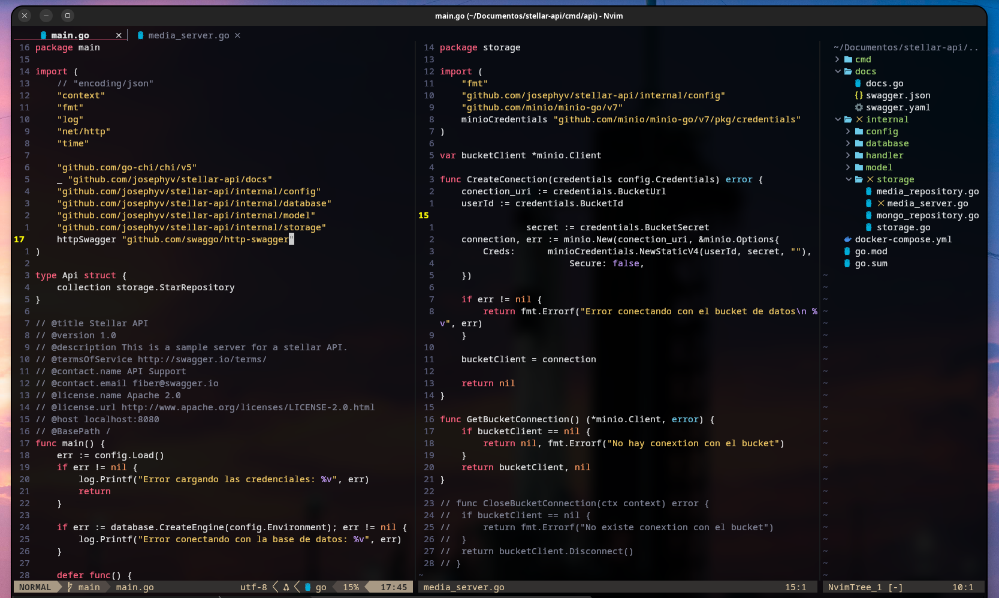

# Minimal Nvim

A minimal configuration bolierplate to use nvim including the basics for development:

- LSP support
- Colorscheme
- BufferLine for buffer adminitration
- Telescope for fin files, grep strings and buffer selection
- Mason for suppor to diferents LSP, Formatters and Linters
- Confort for auto formatting
- Nvim Tree for file explorer
- Tiny Inline Diagnostics for better diagnostics without screen cutter
- Minimal keymaps for windows, buffers, yields and vim motions

